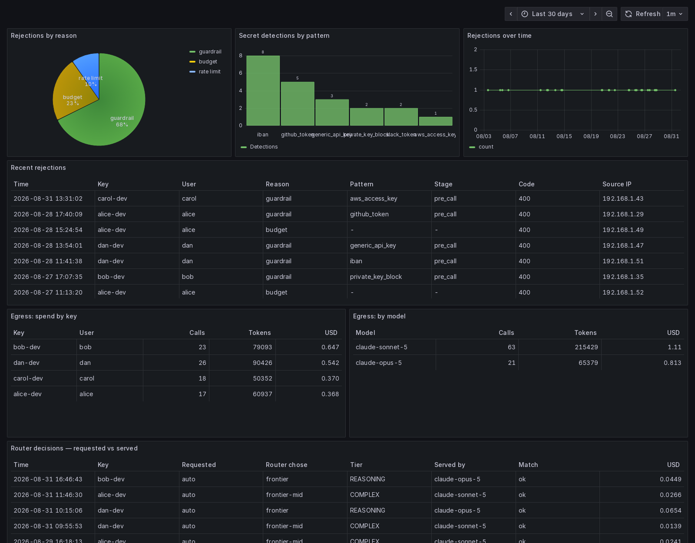
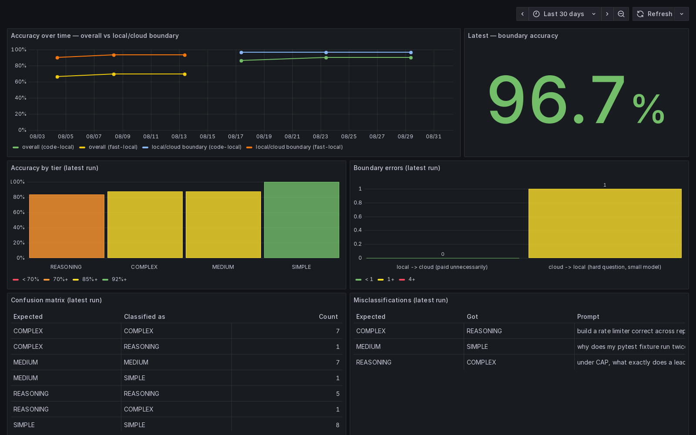

# ai-router

## The problem

Your team writes code with AI help. Three things follow, and all three get worse
as more people join:

- **The bill grows and nobody can explain it.** One invoice arrives at the end
  of the month. You cannot see who spent it, on what, or whether any of it was
  necessary.
- **Everything goes to the most expensive model.** "What does this function do"
  costs the same as designing a distributed system, because the editor only
  knows about one model.
- **Your code leaves the building.** Every prompt goes to a third party. Nobody
  keeps a record, and sooner or later somebody pastes in a file with an API key
  in it.

Nothing in your editor solves this, because your editor talks to one provider
and stops there.

## What this is

A gateway that sits between your editors and the AI providers.

**Use a small AI model running on your own machine for the easy questions, and
pay for Claude only when the question is actually hard.**

You point your editor at one address. Behind it:

- **It decides where each request goes** — your machine or Anthropic. You never
  switch models by hand.
- **Each developer gets a monthly budget** that actually stops working when it
  runs out.
- **Dashboards** show what was spent, on what, and by whom.
- **A safety net** refuses to send anything containing an AWS key, a GitHub
  token or a private key.
- **Everything that left your network is recorded** — who asked, when, which
  model answered, what it cost.

On the setup it was built on, this cut the AI bill by 93 %.

---

## What it looks like

Everything that left your network — who asked, which model answered, what it
cost — plus what the credential guard stopped:



And how well the sorting is working, tracked over time so you can tell whether
changing the local model helped:



*Both screenshots use generated sample data — a month of traffic from four
developers — so the dashboards have something to show. Your own numbers will
differ.*

---

## How it decides

Every request first goes to a small model running on your machine, which reads
it and answers one question: how hard is this?

| Verdict | Where it goes |
|---|---|
| Greeting, factual question, one-line code | your local model |
| Everyday work — add a retry, write a Dockerfile, fix a test | your local model |
| Architecture, tricky debugging, non-trivial code | Claude Sonnet |
| Proofs, open-ended analysis, hard trade-offs | Claude Opus |

Sorting the request costs nothing, because that model runs locally too. In the
reference measurements it put the request on the correct side of the
local/paid line 96.7 % of the time.

---

## Before you start

You need three things:

1. **Docker** with Compose. [Install](https://docs.docker.com/get-docker/)
2. **[Ollama](https://ollama.com)** installed on your machine — this runs the
   local model. Install it and leave it running.
3. **An Anthropic API key** from
   [console.anthropic.com](https://console.anthropic.com) — optional. Without
   one, everything runs locally and hard questions simply get a weaker answer.

Ports 3000, 4000, 8080 and 9090 must be free. Nothing is exposed outside your
machine.

### Which local model

The default everywhere is `qwen2.5-coder:7b`. It is 4.7 GB on disk and takes
about 8.3 GB of memory once loaded.

**One important quirk: Ollama tends to keep only one model in memory at a time.**
Loading a second one evicts the first, and reloading costs about two seconds —
which is fatal for tab completion. So this project points every local alias at
the *same* model rather than using a small one for completion and a larger one
for chat.

| Your RAM | Model | Notes |
|---|---|---|
| 16 GB | `qwen2.5-coder:3b` | 1.9 GB on disk. Faster, noticeably weaker at sorting requests. |
| 32 GB | `qwen2.5-coder:7b` | The measured configuration. Recommended. |
| 64 GB+ | `qwen2.5-coder:14b` | Should sort better still; not measured here. |

Measured on the reference machine — a Mac mini M4 with 32 GB, both models
quantised Q4_K_M with a 32k context:

| | Time to first token | Speed | Sorting accuracy |
|---|---|---|---|
| `qwen2.5-coder:3b` | 80–133 ms | 45 tok/s | 70 % overall, 93.3 % local-vs-paid |
| `qwen2.5-coder:7b` | 159–169 ms | 21 tok/s | 90 % overall, 96.7 % local-vs-paid |

The 3B model is twice as fast and still gets the expensive decision right 93 %
of the time, so it is a reasonable choice if memory is tight. What it loses is
the top end: it almost never recognises a genuinely hard question, so the most
capable model effectively never gets used.

To change model, edit `config/litellm-config.yaml` and restart:
`docker compose --env-file .env restart ai-router-litellm`.

### Ollama settings that matter

Ollama's defaults will hurt. Set these before starting it:

```bash
OLLAMA_KEEP_ALIVE=24h        # default is 5 minutes, after which every request reloads the model
OLLAMA_FLASH_ATTENTION=1
```

---

## Setup

**1. Get the code and the local model**

```bash
git clone https://github.com/martinargalas/ai-router && cd ai-router
ollama pull qwen2.5-coder:7b     # or the model for your RAM, see above
```

**2. Create your settings file**

```bash
cp .env.example .env
```

Open `.env` and fill it in. Every line explains what it is and gives you the
command to generate it — they are mostly random passwords. The one that
matters: `AI_ROUTER_DIR` must be the full path to the folder you just cloned.

**3. Start it**

```bash
docker compose --env-file .env up -d
```

Give it a minute on first run — it downloads a few images.

**4. Prepare the reporting tables**

```bash
for f in sql/*-view.sql sql/eval-tables.sql; do
  docker exec -i ai-router-db psql -U litellm -d litellm < "$f"
done
```

**5. Make yourself a key**

```bash
curl -s localhost:4000/key/generate \
  -H "Authorization: Bearer $LITELLM_MASTER_KEY" \
  -H 'Content-Type: application/json' \
  -d '{"key_alias":"alice","user_id":"alice",
       "models":["auto","fast-local","code-local","frontier","frontier-mid","frontier-fast"],
       "max_budget":10,"budget_duration":"30d","rpm_limit":120}'
```

The reply contains a `key` field starting with `sk-`. **That** is the key your
editor uses. It has a $10 monthly limit; change `max_budget` to whatever you
like.

Do not put `LITELLM_MASTER_KEY` in your editor. It is the administrator key —
it can read and delete everyone else's keys.

**6. Turn on the dashboards**

```bash
PW=$(openssl rand -base64 18 | tr -d '/+=' | head -c 24)
docker exec -i ai-router-db psql -U litellm -d litellm -v pw="$PW" -f - < sql/grafana-readonly-user.sql
echo "GRAFANA_RO_PASSWORD=$PW" >> .env
docker compose --env-file .env up -d ai-router-grafana
```

Open <http://localhost:3000> and log in as `admin` with the password from
`GRAFANA_ADMIN_PASSWORD` in your `.env`. Three dashboards are already there:
spending, what left your network, and how well the sorting works.

---

## Connect your editor

Wherever your editor asks for an OpenAI-compatible endpoint:

- **Address:** `http://localhost:4000/v1`
- **Key:** the `sk-...` from step 5
- **Model:** one of these

| What you're doing | Use | Why |
|---|---|---|
| Chat, asking about code, edits | `auto` | lets it choose; most of it stays local |
| Tab completion | `fast-local` | has to be instant, so it skips the sorting step |
| Agents that edit files on their own | `frontier-mid` | local models can't drive those reliably |

`fast-local` and `code-local` are the model you pulled with Ollama.
`frontier-fast`, `frontier-mid` and `frontier` are Claude Haiku, Sonnet and
Opus. You can repoint any of them in `config/litellm-config.yaml`.

There is a ready-made [Continue](https://continue.dev) config in
`clients/continue-config.example.yaml` — copy it to `~/.continue/config.yaml`
and paste your key in.

Using **Claude Code**? It speaks Anthropic's own format rather than OpenAI's,
so set `ANTHROPIC_BASE_URL=http://localhost:4000` and
`ANTHROPIC_MODEL=frontier-mid`.

Using **Aider**? Point it at the same address with model `auto` — it is the one
agent that works with local models.

---

## Checking on it

```bash
sh reports/weekly-report.sh 7   # what you spent, and what you saved
sh sql/blocked-report.sh 7      # what the safety net stopped
```

You also get alerts when a budget is nearly spent, or when the local model dies
and everything quietly starts going to the paid one. They appear at
<http://localhost:8080> under the topic `ai-router-budget`.

To get those on your phone instead, the notification service has to be
reachable from it — put it behind a reverse proxy, or point Alertmanager at a
hosted one. See `alertmanager/alertmanager.yml`; there is a commented-out
Discord block in there too.

---

## What it won't do

**The safety net catches mistakes, not spies.** It recognises eight kinds of
credential — AWS keys, GitHub and Slack tokens, private keys, Anthropic keys,
`api_key=` lines, IBANs, national ID numbers. It does not understand meaning.
An internal document, a customer name or a description of your unreleased
architecture goes straight through.

**You cannot mark a project as confidential.** The decision is based only on how
hard the question is, never on where the code came from.

**Nobody can read your prompts afterwards, including you.** The record shows
who asked, when, which model answered and what it cost — never the text. That
is on purpose.

**The local model is not as good as Claude.** That is the whole trade. The
sorting step exists to keep the hard questions away from it, and it gets that
right most of the time — not always.

---

If you plan to change how requests are sorted, read
[docs/NOTES.md](docs/NOTES.md) first. It has the measurements behind the numbers
here, the Ollama settings that matter, and a list of LiteLLM features that look
like they are configured but silently do nothing.

MIT licensed — see [LICENSE](LICENSE).
